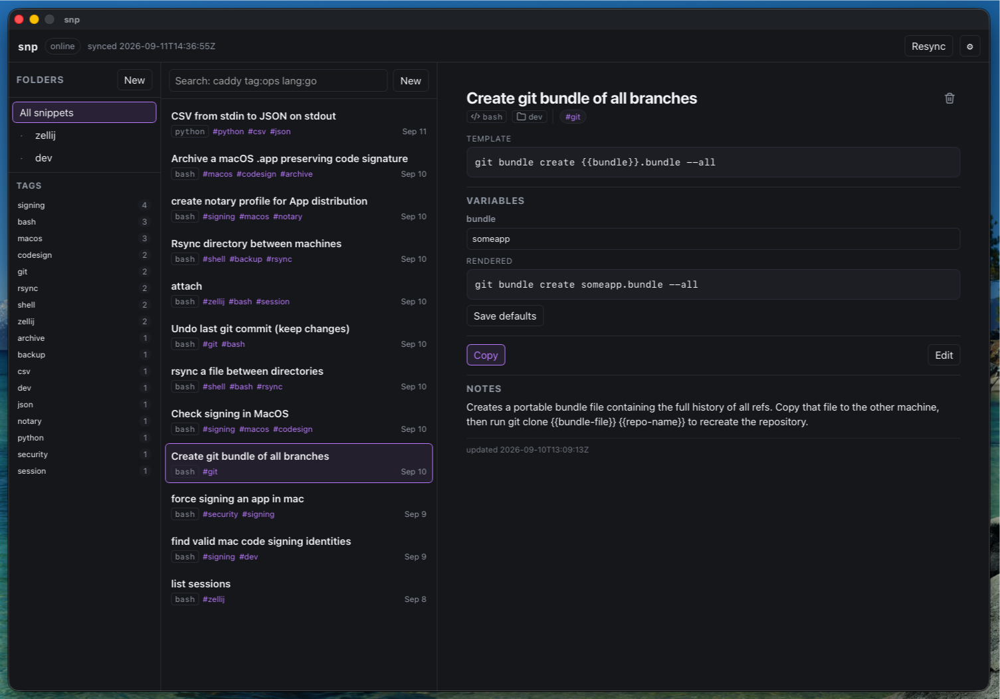
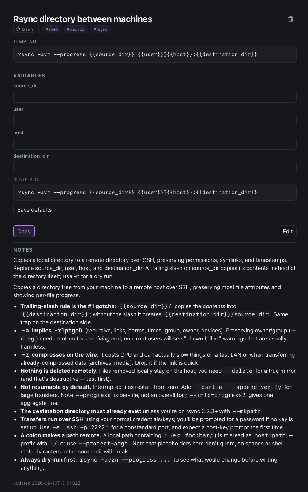
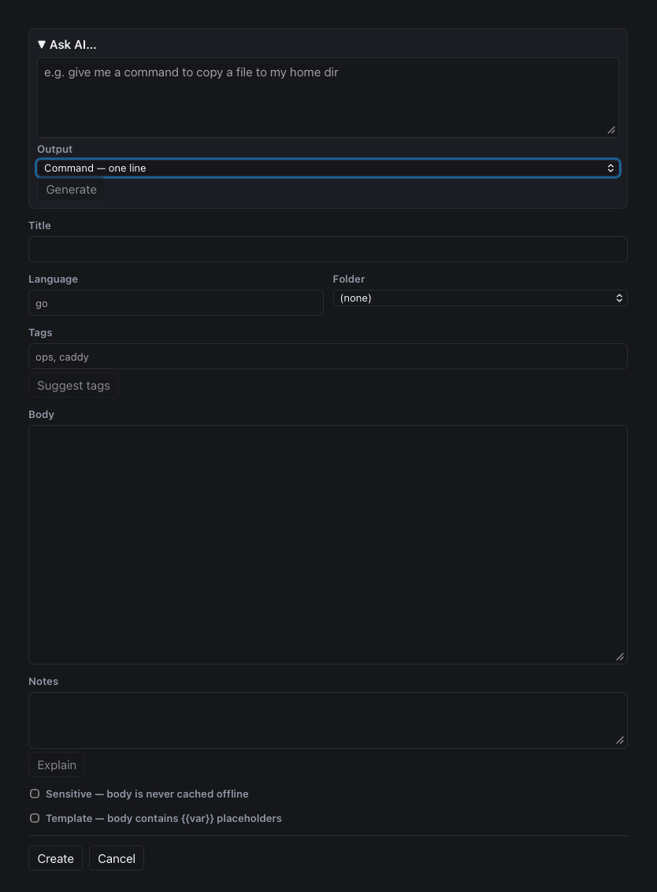

# snp

A personal snippet manager with a Go backend and an embedded Svelte 5 UI.
Run one server on your tailnet and use it through a browser or installed
PWA, or run a local desktop app on macOS/Linux.

Store anything from a one-liner to a whole script, with full-text search,
nested folders, tags, Markdown notes, `{{template}}` variables, and offline
read via PWA.

- Design: [docs/snp-design.md](docs/snp-design.md)
- Implementation plan: [docs/snp-implementation-plan.md](docs/snp-implementation-plan.md)
- Work log: [docs/work-log.md](docs/work-log.md)



*Folders and tags on the left, full-text search over the list, and the open
snippet on the right — here a `git bundle` template with its variables and
the rendered command.*



*Templates: each `{{var}}` becomes a field, the Rendered preview fills in
(and saves) your values, and Notes can carry the gotchas.*

## How it works

The server is one binary, `snp`:

- `snp serve` — joins your tailnet as its own node (embedded tsnet; no
  Tailscale daemon needed on the host), gets an HTTPS certificate from
  Tailscale, and serves the web app plus the JSON API on port 443. Access is
  limited to a single configured owner, identified by Tailscale whois — no
  passwords, no reverse proxy, no containers.
- `snp backup <dest>` — consistent database copy (`VACUUM INTO` + integrity
  check), cron-able.
- `snp export [-o file]` / `snp import <file>` — full JSON export/import
  (plaintext bodies).
- `snp seed` — add the bundled starter snippets (a `Starter` folder with a
  copy-pasteable `snp config.toml`, a template example, and a few everyday
  commands). Nothing seeds by itself; it is also a button in the app's
  settings panel.
- `snp key show-path` — prints the encryption key path, for backup scripts.

`cmd/snp-desktop` is a second binary: the same store and UI in a native
macOS/Linux window, local-only — see
[Desktop app](#desktop-app-macos--linux-wails).

Storage is SQLite with FTS5 under `state_dir` (default
`~/.local/share/snp`): `snp.db` (the database), `key` (AES-256-GCM key for
sensitive snippets), `tsnet/` (tailscale node state). Sensitive snippets are
encrypted at rest; their bodies are never indexed or stored in the PWA's
local cache.

## Requirements

### Building from source

- Go **1.26.6 or newer**, as declared in `go.mod`.
- Node.js **24.x** for the web build and tests. The locked test tools also
  support Node 22.12+ within 22.x, or 26+; Node 20 does not satisfy the
  full test toolchain.
- npm and make. Build commands below run from the repository root.

### Server requirements

- A Tailscale tailnet with **MagicDNS** and **HTTPS certificates** enabled
  (admin panel). The Tailscale certificate only validates for the tailnet
  DNS name, so the app must be reached by `https://snp.<your-tailnet>.ts.net`
  — never by a `100.x` IP.
- An always-on systemd Linux host with cron running for the installed
  daily backup. The binary joins the tailnet itself via tsnet.
- Client devices connected to the tailnet under the configured owner's
  identity. The host does not need a separate Tailscale daemon.

The server can be built elsewhere and shipped as a single binary; its
runtime needs neither Go nor Node.js.

### Desktop requirements

- macOS or Linux; no tailnet or configured owner is required.
- To build on macOS: Xcode Command Line Tools for CGO.
- To build on Linux: a C compiler, pkg-config, GTK3 and WebKitGTK development
  packages. The matching GTK/WebKit shared libraries are needed at runtime.
  See the [desktop build guide](docs/desktop.md) for package names and
  platform details.

## Quick start

### Tailnet server

From a checkout on the target Linux host, with the requirements above met:

```sh
make build
sudo TS_AUTHKEY=tskey-... ./deploy/install.sh -o your-tailnet-login
```

Replace the auth key and login with your own values, then open
`https://snp.<your-tailnet>.ts.net` from an owner device on your tailnet.
See [Installing](#installing-one-command) for configuration and verification.

### Local desktop

From a checkout on the Mac or Linux machine where the app will run:

```sh
make run-desktop
```

This builds the web app and desktop binary, then opens the local window.
See [Desktop app](#desktop-app-macos--linux-wails) for packaging and installation.

## Building

```sh
make build      # builds web/dist (Svelte + Vite), then bin/snp
make test       # go vet + Go tests + Vitest + svelte-check/TypeScript
```

Both binaries carry a version (`snp version`, `snp-desktop -version`),
stamped from `git describe` by the Makefile or from the tag by the
release workflow; a plain `go build` reports `dev`.

The web app is embedded into the binary with `go:embed`, so `web/dist` must
exist when the Go binary is built; `make build` handles that. To build on
one machine and deploy on another (e.g. an x86_64 server), build the web app
anywhere, then cross-compile:

```sh
(cd web && npm ci && npm run build)
GOOS=linux GOARCH=amd64 go build -o bin/snp ./cmd/snp
```

## Releases

Prebuilt binaries are on the [releases page](https://github.com/jstevewhite/snp/releases):

| File | What |
|---|---|
| `snp_<ver>_linux_{amd64,arm64}.tar.gz` | Server / CLI + installer |
| `snp_<ver>_darwin_universal.tar.gz` | macOS CLI |
| `snp-desktop_<ver>_macos_universal.zip` | macOS app |
| `snp-desktop_<ver>_linux_{amd64,arm64}.tar.gz` | Desktop + installer |
| `SHA256SUMS` | Checksums. |

Linux server archives include `deploy/install.sh`, `snp.service`, and
`backup.sh`; unpack one and run the install command below from that
directory. Linux desktop archives include `deploy/install-desktop.sh`
and require WebKitGTK **4.1** (Ubuntu 24.04+, Debian 13+, Fedora 40+ or
similar).

Both macOS archives support Apple silicon and Intel. The desktop archive
contains `snp.app`, signed and notarized when the repo's Apple secrets are
set; otherwise it is ad-hoc signed and Gatekeeper asks you to allow it.

Cutting a release: push a `v*` tag (`git tag v0.4.0 && git push origin
v0.4.0`). `.github/workflows/release.yml` builds every platform in
parallel and publishes the release only once all of them succeed.
The `beta` workflow in the Actions tab does the same for a manually
entered `v*-beta.N` label and marks it a prerelease. See the header of
`.github/workflows/build-release.yml` for the macOS signing secrets.

## Installing (one command)

On the target host, from a checkout with `bin/snp` already built for that
host (see [Building](#building)):

```sh
sudo TS_AUTHKEY=tskey-... ./deploy/install.sh -o your-tailnet-login
```

- `-o` your Tailscale login (e.g. `you@github`) — the only identity allowed
  in. Find it in the admin panel or via `tailscale whois <a-tailnet-ip>` on
  any tailnet machine.
- `TS_AUTHKEY` joins the node to your tailnet the first time (admin panel,
  or `tailscale authkeys`). It is written to
  `/var/lib/snp/.config/snp/authkey` and **kept** there: after the first
  join it is only needed again if the node state is wiped.
- `-n` sets the node name (default `snp`); `-b` points at a prebuilt binary
  (default `./bin/snp`).

The script creates the `snp` user (home `/var/lib/snp`), installs
`/usr/local/bin/snp`, writes the starter config to
`/var/lib/snp/.config/snp/config.toml` (an existing config is kept),
installs and enables the `snp.service` systemd unit, and sets up a daily
backup (cron, 03:17) into `/var/lib/snp/backups` via
`/usr/local/sbin/snp-backup`.

Then check:

```sh
systemctl status snp
journalctl -u snp -f        # watch the first join
```

From any other tailnet machine:

```sh
curl https://snp.<your-tailnet>.ts.net/api/me
# → {"login":"you@github","display_name":"..."}
```

Open `https://snp.<your-tailnet>.ts.net` in a browser.

## Auto-deploy from a checkout (developer box)

For a machine that has the repository checked out and builds it locally,
`deploy/install-autoupdate.sh` runs the server as a **systemd user unit**
straight from `bin/snp` and redeploys whenever `origin/main` moves:

```sh
make build
deploy/install-autoupdate.sh -n snip        # node name; default snp
```

The owner and other settings come from `~/.config/snp/config.toml`; an
optional `deploy/.authkey` (`TS_AUTHKEY=tskey-...`) is read for the first
join. Lingering must be on (`sudo loginctl enable-linger $USER`) so the
units outlive the login session.

Every five minutes (`-i` changes the interval) `snp-update.timer` fetches
`origin/main`. When it is strictly ahead of the checkout, and the checkout
is on `main` with a clean tree, `deploy/update.sh`:

1. keeps the current binary as `bin/snp.prev`, fast-forwards, and runs
   `make build` — the running server is untouched until both succeed;
2. backs up the database with the *previous* binary into
   `~/.local/share/snp/pre-deploy/` (last five kept);
3. restarts `snp.service` and polls `https://<node>.<tailnet>.ts.net/api/me`
   for up to 60 seconds — that endpoint answers 200 only to the owner, so
   the check proves the tailnet join and the auth path, not just the port;
4. on failure, puts the previous binary back, restores the backup if the
   schema version changed (the failed database is kept alongside), resets
   the checkout, restarts, and records the bad commit in
   `deploy/.last-failed`. That commit is skipped until `origin/main` moves
   on, and `snp-update.service` stays failed so it shows in
   `systemctl --user --failed`.

A checkout on another branch, with local commits ahead of origin, or with
uncommitted changes is left alone. Point the installer at a dedicated
clone if you edit in this one and want deploys to keep flowing.

```sh
deploy/update.sh -f                  # deploy by hand (rebuild + restart)
journalctl --user -u snp-update      # deploy history
journalctl --user -u snp -f          # the server
```

A hand run takes the node name from the installed unit, so `-n` is only
for a checkout with no unit. Before restarting anything, the script
probes the health URL against the server that is already running and
refuses to continue if it does not answer 200: a wrong URL would
otherwise look like a failed deploy and roll a healthy server back.

## Everyday use

Create a snippet with a title and body, then add a language, folder, tags,
and Markdown notes as useful. Search combines text with filters:

| Search | Finds |
|---|---|
| `git bundle` | Snippets matching the search terms |
| `tag:ops` | Snippets tagged `ops` |
| `lang:bash` | Snippets with language `bash` |
| `backup tag:ops lang:bash` | Matches for `backup` with both filters applied |

For a template, put placeholders in the body:

```text
printf '%s\n' "Hello, {{name|world}}"
```

The form detects the template. After saving, fill in `name` in the
variables panel and use the Rendered preview to check the result before
copying. `{{name|world}}` defaults to `world`; `{{name}}` has no default.
A blank variable without a default is copied as an empty string. **Copy
template** keeps the placeholders for reuse; **Copy rendered** writes the
filled-in text. **Save defaults** remembers the values you type for that
snippet, and stays inert until you actually change something.

Pin the commands you reach for daily with the pin control beside a
snippet's title; they collect under **Favorites**, above the folders.
`Cmd/Ctrl+K` jumps to the search box (the field shows the shortcut), the
arrow keys move through the results, `Enter` copies the selected snippet,
and `Escape` clears the query.

`Cmd/Ctrl+Shift+P` opens the **command palette**: type to filter, arrows
to move, `Enter` to run. It lists everything the app can do from the
keyboard — new, edit, copy, favorite, delete and reveal for the selected
snippet, new folder, focus search, resync, full resync, the starter pack,
and the layout modes. Commands that cannot run right now stay listed,
greyed, with the reason beside them (offline, nothing selected). The
settings sheet shows both shortcuts.

**Settings → Add starter snippets** adds a sample config, a template, and
some everyday commands. Applying the starter pack again overwrites edits
to its bundled snippets and restores any you deleted.

### Duplicate a snippet

Select a snippet and click **Duplicate**, or choose **Duplicate snippet**
from the command palette. A new draft opens as `Title (copy)` with the
original body, folder, tags, notes, template defaults, favorite status and
sensitivity. Edit it and click **Create** to save a separate snippet with
fresh history. The original is unchanged; discarding the draft saves
nothing. Duplication requires a connection, including for sensitive bodies.

### Trash and revision history

Deleting a snippet moves it to **Trash** in the folders pane. Use the
brief **Undo** action or open Trash and choose **Restore**. Deleted
snippets are automatically removed after 30 days. If their original
folder is gone, they return to Unfiled.

Open a snippet and choose **History** beside Edit to compare and restore
previous versions. The latest 50 changed versions are kept, including
content overwritten by imports. Restoring saves the current version first
and keeps the current favorite setting. History starts with the first edit
after upgrading; unchanged saves and favorite toggles do not add versions.
Trash and revision history are also available in the command palette.

Both features require a connection. Sensitive history is encrypted and
requires **Reveal comparison** to view; marking a snippet sensitive also
encrypts its earlier versions. Restoring protected history keeps the
snippet sensitive. Historical content stays out of the offline cache.
Database backups retain trash and history; JSON exports include only
current live versions. Keep the encryption key with database backups.

### Import, export and backup

Open **Settings → Import, export & backup** (also in the command palette).
All three operations require a connection; desktop uses native Open/Save
dialogs, while browsers use their file picker and downloads.

- **Import JSON:** choose a snp JSON export, up to 10 MiB, then **Preview
  import**. Merge updates matching IDs and keeps other snippets. Replace
  moves snippets missing from the file to Trash and requires an explicit
  acknowledgement before **Import now**. Overwritten content is preserved
  in revision history. IDs omitted from a file create new snippets each
  time it is imported. Encrypted `.json.age` files prompt for their password
  before preview (16 MiB encrypted-file limit). Use `snp decrypt` followed
  by `snp import` for larger protected exports.
- **Export JSON:** downloads current live snippets and folders, including
  tags, favorites, notes and template defaults, including sensitive bodies.
  Trash and history are excluded.
- **Full backup:** downloads a ZIP with a verified SQLite snapshot, the
  matching encryption key, and restore instructions. Includes Trash and
  history, but not app preferences, configuration or Tailscale state.
  Password protection covers the entire archive, including its key.

**Encrypt exports and backups with a password** defaults on for every
download, including backups with sensitive Trash or historical revisions.
Enter and confirm a long, unique passphrase (at least 12 characters). Files
use standard [age passphrase encryption](https://age-encryption.org/),
saved as `.json.age` or `.zip.age`. snp does not store the password; it is
separate from the database encryption key. Unchecking protection produces
readable JSON or a ZIP containing the key; keep those files private.

**If you forget this password, you're toast.** There is no password reset
or recovery for the encrypted file. Save the password somewhere safe.

To unlock a protected backup, run this in a terminal:

```sh
snp decrypt backup.zip.age restored.zip
```

The command prompts privately for the password, works without the original
database/key, refuses to overwrite existing files, and publishes a private
output only after verifying the complete encrypted file. Standard `age`
tools can also decrypt these files. Keep the decrypted ZIP private.

To restore a backup, stop snp, preserve your existing state directory,
then extract `snp.db` and `key` into a new empty directory. Start snp with
`--state-dir` pointing there and choose **Settings → Full resync** on each
client. Detailed instructions are included in `RESTORE.txt`. JSON Import
accepts JSON exports, not backup ZIPs.

Imports preserve creation dates and set update dates to the import time
so every client receives the imported changes through normal sync.

### Appearance and layout

**Settings → Theme** offers Auto (system), Light, Dark, Slate Blue (system),
Nixie, CRT, Solarized Light, Solarized Dark, Kimbie Dark, and Tokyo Night.
**Nixie** uses warm amber glow and a glass-like version badge; **CRT** uses
green phosphor. Both add static scanlines behind code and soft glow without
changing the layout. Theme choices are remembered in the browser and
desktop app.

The pin in the **Folders** header controls the wide layout. Pinned gives
you three panes; unpinning leaves the snippet list and detail side by side.
Use the top-left **Folders** button to open favorites, folders, and tags
as a flyout, then pin it again to keep it visible. Escape, an outside
click, or selecting a folder or favorite closes the flyout; selecting tags
keeps it open so you can combine filters.

The pin preference and divider widths are remembered, with separate widths
for the two- and three-pane arrangements. Drag a divider to resize, or
double-click it to reset the current arrangement. Compact mode always uses
the folders drawer; returning to wide mode restores your pin preference.

**Settings → Interface text size** scales the interface from 75–150%.
The list's **Compact**, **Regular**, and **Large** buttons control card
density independently; **Two-line titles in the list** allows longer
titles to wrap.

## Using the PWA

Install it so it works offline:

- **macOS (Chrome/Edge):** toolbar / menu → “Install snp”.
- **macOS (Safari):** File or Share → “Add to Dock” (macOS Sonoma or
  later; [Apple instructions](https://support.apple.com/en-us/104996)).
- **iOS:** Safari → Share → “Add to Home Screen”.
- **Android:** Chrome → menu → “Install app”.

Phone layout: below about 720px the app shows one screen at a time — the
search box and list first, a tap opens the snippet with a **←** Back
control, and the top-left folder icon (or the **Folders** button beside the
search box) slides in the favorites, folders and tags. The phone's back
gesture works at every level. **Settings → Layout** forces the wide or
compact arrangement regardless of width; in compact mode the version,
connection, sync age and **Resync** live at the top of the settings sheet.

Offline: browsing and search work from the local cache; creating, editing,
and deleting are disabled (nothing is queued), and revealing a sensitive
snippet requires a connection. When you come back online the app syncs
automatically. If the server was ever restored from an older backup, use
**Settings → Full resync** to re-cache from scratch.

## Desktop app (macOS & Linux, Wails)

snp also runs as a native desktop app (design §12): `snp-desktop` is a
*local instance* — the same store and the same UI in a Wails window, with
no tailnet, no HTTP listener, and no owner.

Desktop and CLI/server instances share data only when they use the same
local `state_dir` with appropriate filesystem access. Your desktop defaults
to `~/.local/share/snp` under your own account; the installed systemd
service defaults to `/var/lib/snp/.local/share/snp` under the `snp` account.
The desktop app does not sync with a remote tailnet server.

- **No server, no port.** The SPA's `/api` calls run in-process through a
  bridge (`internal/desktop`) against the same handler `snp serve` uses,
  so core snippet features work offline. AI actions require access to the
  configured provider, which the desktop process calls directly.
- **No PWA machinery.** Nothing to install and nothing to cache: the
  service worker and offline banner are inert in the window, and
  **Settings → Full resync** is never needed.
- **Configuration matches the CLI** (`--config`, `--state-dir`,
  `--ai-key`, `SNP_*`, …), except that no `owner` is required;
  `--hostname` and `--owner` are accepted and ignored.
- **A plain native window.** 1150×760 by default (minimum 400×560, narrow
  enough for the compact layout),
  themed before the first paint, with in-app dialogs where the webview
  has no `prompt`/`confirm`.

Build and launch it:

```sh
make run-desktop          # builds web + binary, opens the window
make desktop             # builds web + bin/snp-desktop without launching
```

Install it:

```sh
make app                  # macOS: builds build/snp.app; ad-hoc signed by default
make run-app              # macOS: builds the bundle, then opens it
make desktop-install      # Linux: installs to ~/.local (override PREFIX=)
```

`make app` produces an ad-hoc, un-notarized bundle by default; it needs no
Apple signing credentials for local use. Distribution signing and
notarization require your own `SIGN_IDENTITY` and `NOTARY_PROFILE`.

The desktop binary must be built on its target OS. See the
[desktop build and packaging guide](docs/desktop.md) for Linux packages,
WebKit selection, macOS linking, signing, and notarization. Windows support
is a follow-on.

## Configuration

TOML file, discovered in order: `--config` flag → `$SNP_CONFIG` →
`$XDG_CONFIG_HOME/snp/config.toml` → `~/.config/snp/config.toml`. Every key
also has a flag and an `SNP_*` environment variable; flag beats env, env
beats file:

| Key | Flag | Env | Default |
|---|---|---|---|
| `hostname` | `--hostname` | `SNP_HOSTNAME` | `snp` |
| `owner` | `--owner` | `SNP_OWNER` | (required for server) |
| `state_dir` | `--state-dir` | `SNP_STATE_DIR` | `~/.local/share/snp` |
| `log_level` | `--log-level` | `SNP_LOG_LEVEL` | `info` |
| `ai_endpoint` | `--ai-endpoint` | `SNP_AI_ENDPOINT` | [OpenAI][ai-default] |
| `ai_model` | `--ai-model` | `SNP_AI_MODEL` | `gpt-4o-mini` |
| `ai_key` | `--ai-key` | `SNP_AI_KEY` | (AI disabled until set) |

[ai-default]: https://api.openai.com/v1

`owner` is optional for the desktop app and dev mode.

For the systemd service, `HOME=/var/lib/snp`, so the defaults resolve to
`/var/lib/snp/.config/snp/config.toml` and `/var/lib/snp/.local/share/snp`.

## AI features (optional)

With `ai_key` set (design §13), a **one-shot** "Ask AI…" control appears
in the snippet form: type something like *"give me a command to copy a
file to my home dir"* and it fills the form with a templatized snippet
(`cp -rf {{file}} ~/`) in Body plus a short plain-text explanation of
what it does in Notes, for you to review, tweak, and save like any
other snippet. No chat history, and nothing is stored by the feature
itself.

The control's **Output** selector picks what the model should produce:
**Command** (the default — one executable line), **Script** (a complete
multi-line program, with a shebang for shell scripts and how-to-run
notes), or **Function** (one named function definition, with its
parameters and a call example in Notes). The reply lands in the same
fields either way.

Two additional controls work on the current form contents:

- **Suggest tags** sends the body, optional title and language, and the
  collection's existing tag vocabulary to the provider. Suggested tags
  merge into the Tags field.
- **Explain** sends the body to the provider and replaces Notes with a
  Markdown explanation. **Undo** restores the previous Notes; manually
  editing Notes clears that undo point.

**Ask AI** sends your prompt, optional language, and the selected output
kind's instructions; it does not include the existing body. Each action
is a single request without chat history. Prompts and bodies are not
logged by snp, and form changes are stored only when you save.

The **Sensitive** flag protects bodies at rest, excludes them from search
indexing and offline caching, and disables **Explain** and **Suggest tags**.
Marking a draft sensitive also prevents pending results from changing its
Notes or tags, but cannot recall content already sent. **Ask AI** does not
include the existing body; sensitive text you type into its prompt is
still sent to the configured provider.



*Ask AI… opens at the top of the new-snippet form: describe what you want,
choose an Output, and the reply lands in the fields below it.*

Any OpenAI-compatible endpoint works — OpenAI, or a self-hosted one
(ollama, llama.cpp, …) via `ai_endpoint`:

```toml
ai_endpoint = "http://127.0.0.1:11434/v1"   # e.g. ollama
ai_model    = "llama3.2"
ai_key      = "ollama"                       # any non-empty value
```

When unconfigured the AI controls are hidden; `GET /api/ai/status` reports
whether it is on, and the model name — never the endpoint key.

## Backups

Daily at 03:17, cron runs `/usr/local/sbin/snp-backup` (the installed
`deploy/backup.sh`) as the `snp` user:

```sh
snp-backup DEST_DIR [retention_days]
```

- writes `DEST_DIR/snp-YYYYmmdd-HHMMSS.db` — a consistent `VACUUM INTO`
  copy, verified with an integrity check before the script finishes;
- copies the encryption key alongside as `snp.key` (overwritten each run);
- deletes `snp-*.db` files older than `retention_days` (default 7).

Copying backups offsite (rsync/rclone) is the operator's job, by design.

### Restoring

```sh
sudo systemctl stop snp
sudo cp /path/to/snp-YYYYmmdd-HHMMSS.db /var/lib/snp/.local/share/snp/snp.db
sudo rm -f /var/lib/snp/.local/share/snp/snp.db-wal \
           /var/lib/snp/.local/share/snp/snp.db-shm
# The key must be the one that went with this backup:
sudo cp /path/to/snp.key /var/lib/snp/.local/share/snp/key
sudo chown -R snp:snp /var/lib/snp/.local/share/snp
sudo systemctl start snp
```

After restoring an *older* backup, PWA clients that cached a newer state
should use **Settings → Full resync**.

## Warnings, in plain language

- **The key file is required to read sensitive snippets from a backup.** A
  database backup without its `snp.key` still gives you everything
  non-sensitive, but sensitive bodies are AES-256-GCM ciphertext and are
  unrecoverable without the matching key. Back them up together (the backup
  script does this) and keep them equally safe.
- **Export files are as sensitive as the database plus key.** `snp export`
  and `GET /api/export` write every body in plaintext, including sensitive
  ones. App downloads default to password protection; disabling it produces
  plaintext files. Store and transfer unprotected copies accordingly.
- **Don't delete `state_dir/tsnet` casually.** It holds the node's tailnet
  membership. Deleting it forces the next start to re-join the tailnet,
  which needs `TS_AUTHKEY` again.
- **`--dev-listen` is unauthenticated.** It serves plain HTTP with no tsnet
  and no auth, for local development only. Never expose it beyond the
  machine.
- **Anyone with the key file and the database can read everything.** The key
  is not derived from a passphrase; that is the accepted threat model.
  Protect `/var/lib/snp/.local/share/snp` (0700, owned by `snp`) and the
  backups.
- **AI actions send content to the configured provider.** Ask AI sends
  your prompt; Explain and Suggest tags send the current snippet body,
  and are disabled when the snippet is marked Sensitive. Tag suggestions
  also send the title, language, and collection's tag vocabulary. Use a
  provider you trust or a local OpenAI-compatible endpoint, and review
  generated snippets before running them. See
  [AI features](#ai-features-optional) for details.

## Logs

`snp` logs structured lines to stdout; journald captures them:

```sh
journalctl -u snp -f
journalctl -u snp --since "1 hour ago"
```

Request logs include method, path, status, and duration — never query
strings or bodies.

## Development

```sh
make dev        # build + serve on 127.0.0.1:8080 (no tsnet, no auth)
make test       # go test + web tests
```

The API is plain JSON under `/api` (spec §5);
`GET /api/snippets/{id}/raw` returns the decrypted body as `text/plain`,
for `curl | sh`-style use.

## Repository layout

```text
cmd/snp/                 main, subcommand wiring
cmd/snp-desktop/         native wails window (macOS/Linux)
internal/config/         toml + flags + env resolution
internal/store/          sqlite open/migrate, queries, fts, crypto
internal/store/migrations/*.sql
internal/server/         router, middleware, handlers, embedded static
internal/tsauth/         tsnet listener and whois identity
internal/desktop/        in-process API bridge (no wails import)
internal/ai/             one-shot snippet generator
internal/starter/        bundled starter snippet pack
web/                     svelte app; web/dist is embedded
deploy/                  snp.service, install.sh, backup.sh; user-unit
                         auto-deploy (update.sh, autoupdate.sh, user/)
docs/                    design, plan, work log, screenshots
Makefile                 build web, build binary, test
```

## Notes on AI

This began as a project to compare various models and their ability to
produce useful code. I've been a user of Snippetlab, but they dropped out of
SetApp, so I needed a new snippet manager, and decided it was a good test.
So I gave the task to Opus 5, chat gpt Sol, qwen3.8-27b (initially). Opus
made the best out of the gate, but I was blown away by what qwen3.8-27b
produced, running locally, using the deepseek-harness and /goal. Sol's was
prettiest but had weird commentary all over the front page (every option had
an aphorism attached, like *saving your most valuable work*). It was also
enormous.

This program is the one I'm using, and it was initially created by
qwen3.8-27b running on my GX10 (DGX Spark clone), and then polished by
qwen3.8-flash-next (same box) and then deepseek-v4-flash-vision-exp, which
is insanely fast and at this level, incredibly functional. CLAUDE was used
to review code. The AGENTS file has a commit flag - to append harness and
model of all commits.
